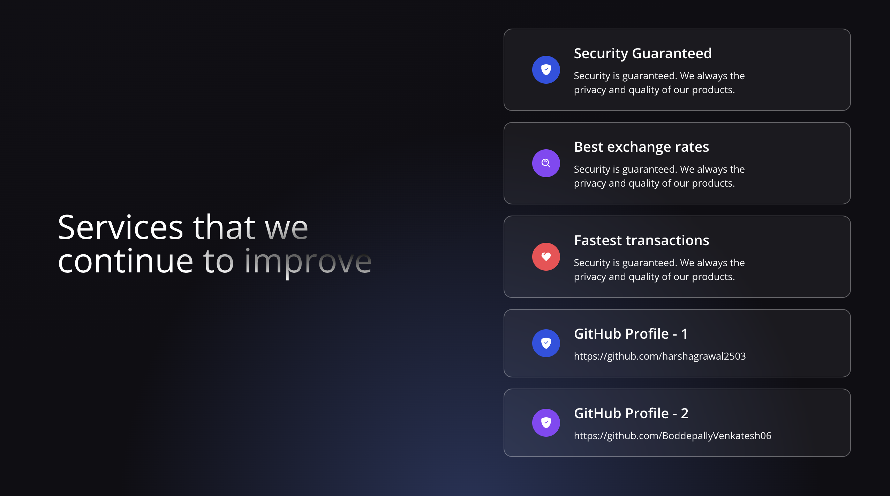

# Krypt - Web 3.0 Blockchain Application



## Introduction

Welcome to the world of Web 3.0! In this tutorial, we will guide you through the process of building your first real Web 3.0 Application using Krypt Web 3.0 methodologies, Solidity, and Metamask. Web 3.0 represents the next evolution of the internet, focusing on decentralized applications (dApps) and blockchain technology.

### Prerequisites

Before you start, make sure you have the following prerequisites installed:

- [Node.js](https://nodejs.org/)
- [npm](https://www.npmjs.com/) (Node Package Manager)
- [Truffle](https://www.trufflesuite.com/truffle) (Development framework for Ethereum)
- [Ganache](https://www.trufflesuite.com/ganache) (Personal blockchain for Ethereum development)
- [Metamask](https://metamask.io/) (Ethereum wallet extension for browsers)

### Project Overview

This project demonstrates a simple decentralized application where users can interact with a smart contract deployed on the Ethereum blockchain. The frontend is built using HTML, CSS, and JavaScript, while the backend smart contract is written in Solidity.

## Getting Started

Follow these steps to set up and run the project locally:

1. Clone this repository:

   ```bash
   git clone https://github.com/BoddepallyVenkatesh06/Krypt-Web-App.git
   cd Krypt-Web-App
   ```

2. Install dependencies:

   ```bash
   npm install
   ```

3. Compile and migrate the smart contract:

   ```bash
   truffle compile
   truffle migrate
   ```

4. Start the development server:

   ```bash
   npm start
   ```

5. Open your browser and navigate to `http://localhost:3000/`.

## Usage

1. Ensure Metamask is installed in your browser.
2. Connect Metamask to your local Ganache blockchain.
3. Interact with the decentralized application, which allows you to perform specific actions on the smart contract.

## Contributing

If you would like to contribute to this project, feel free to open issues or submit pull requests. We welcome any suggestions, improvements, or bug fixes.

https://github.com/harshagrawal2503

## Launch My Web App in the below

https://krypt-web-app.netlify.app/

## License

This project is licensed under the MIT License - see the [LICENSE](LICENSE) file for details.

Happy coding in the Web 3.0 era! 🚀
